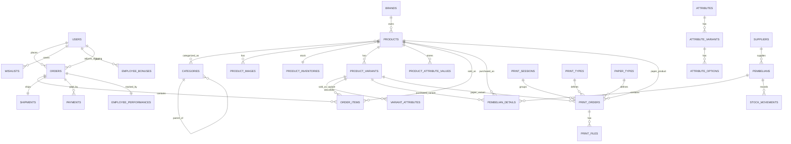

# Dokumentasi Project Viviashop

## 1. Ringkasan Project

Viviashop adalah aplikasi e-commerce berbasis Laravel yang dirancang untuk kebutuhan penjualan produk, pengelolaan pesanan, manajemen stok, pembelian ke supplier, serta layanan cetak/print service. Berdasarkan struktur kode, aplikasi ini bukan hanya toko online biasa, tetapi platform operasional yang menggabungkan penjualan online, inventori, procurement, pembayaran, pengiriman, laporan bisnis, dan modul produksi cetak.

Dokumentasi ini disusun berdasarkan observasi terhadap route, model, controller, view, service, dan migrasi pada project. Referensi kode utama yang menjadi sumber analisis dapat dilihat pada:

- [routes/web.php](../routes/web.php)
- [app/Models/Product.php](../app/Models/Product.php)
- [app/Models/Order.php](../app/Models/Order.php)
- [app/Http/Controllers/Frontend/HomepageController.php](../app/Http/Controllers/Frontend/HomepageController.php)
- [app/Http/Controllers/Frontend/ProductController.php](../app/Http/Controllers/Frontend/ProductController.php)
- [app/Http/Controllers/Frontend/CartController.php](../app/Http/Controllers/Frontend/CartController.php)
- [app/Http/Controllers/Frontend/OrderController.php](../app/Http/Controllers/Frontend/OrderController.php)
- [app/Http/Controllers/Admin/PrintServiceController.php](../app/Http/Controllers/Admin/PrintServiceController.php)
- [app/Http/Controllers/PembelianController.php](../app/Http/Controllers/PembelianController.php)
- [app/Http/Controllers/PembelianDetailController.php](../app/Http/Controllers/PembelianDetailController.php)
- [app/Http/Controllers/Admin/ReportController.php](../app/Http/Controllers/Admin/ReportController.php)
- [resources/views/frontend/homepage.blade.php](../resources/views/frontend/homepage.blade.php)
- [resources/views/frontend/shop/index.blade.php](../resources/views/frontend/shop/index.blade.php)
- [resources/views/frontend/shop/detail.blade.php](../resources/views/frontend/shop/detail.blade.php)
- [resources/views/frontend/carts/index.blade.php](../resources/views/frontend/carts/index.blade.php)
- [resources/views/frontend/orders/checkout.blade.php](../resources/views/frontend/orders/checkout.blade.php)
- [resources/views/frontend/orders/show.blade.php](../resources/views/frontend/orders/show.blade.php)
- [resources/views/frontend/auth/profile.blade.php](../resources/views/frontend/auth/profile.blade.php)

## 2. Gambaran Umum Aplikasi

Aplikasi ini melayani beberapa domain bisnis sekaligus:

- Penjualan produk fisik melalui katalog online.
- Produk sederhana dan produk configurable dengan varian multi-atribut.
- Checkout dengan beberapa metode pembayaran.
- Integrasi ongkir dan wilayah pengiriman Indonesia.
- Manajemen pesanan lengkap untuk customer dan admin.
- Pengelolaan stok, stock movement, dan stock card.
- Proses pembelian ke supplier dengan detail item dan update stok.
- Modul employee performance dan bonus.
- Modul print service dengan session, file upload, dan workflow produksi.
- Laporan penjualan, produk, inventori, pembayaran, dan ekspor Excel/PDF.

Secara UI, frontend memakai pendekatan visual yang bersih dan dominan hijau, dengan halaman depan yang menonjolkan produk unggulan, layanan cetak, dan promosi sosial media. Struktur halaman juga menunjukkan aplikasi ini diarahkan untuk operasional toko percetakan atau toko ATK yang memiliki produk fisik sekaligus layanan print.

## 3. Tujuan Aplikasi

Tujuan utama Viviashop dapat diringkas sebagai berikut:

- Menyediakan kanal penjualan online yang mudah diakses pelanggan.
- Menyatukan proses katalog, cart, checkout, pembayaran, dan pelacakan pesanan.
- Mempermudah owner/admin dalam mengelola produk, stok, supplier, dan pesanan.
- Mencatat pembelian barang masuk agar stok dan margin bisnis terkontrol.
- Mengelola layanan cetak secara terstruktur dari upload file sampai penyelesaian order.
- Menyediakan laporan bisnis untuk pengambilan keputusan.
- Mendukung operasional toko dengan tracking kinerja karyawan dan pemberian bonus.

## 4. Manfaat Aplikasi

### 4.1 Manfaat untuk User/Pelanggan

- Pelanggan bisa melihat katalog produk, mencari produk, memfilter berdasarkan kategori dan atribut, serta melihat detail varian.
- Pelanggan dapat menambahkan produk ke keranjang dengan validasi stok.
- Checkout mendukung data alamat, pilihan pengiriman, dan beberapa metode pembayaran.
- Pelanggan bisa memantau status pesanan, melihat invoice, dan melakukan konfirmasi pembayaran manual bila dibutuhkan.
- Pelanggan memiliki akses ke profil, riwayat order, dan wishlist.
- Untuk layanan cetak, pelanggan mendapatkan alur pemesanan yang lebih jelas dan terstruktur.

### 4.2 Manfaat untuk Owner/Admin

- Owner dapat mengelola stok, harga jual, harga beli, dan data supplier secara terpusat.
- Order bisa diproses lebih cepat karena ada workflow status yang jelas.
- Integrasi pembayaran otomatis mengurangi proses manual.
- Modul procurement membantu owner memonitor pembelian barang masuk dan biaya barang.
- Modul laporan membantu evaluasi penjualan, produk terlaris, inventori, dan pembayaran.
- Employee performance memberi visibilitas terhadap kontribusi karyawan.
- Print service membuat bisnis percetakan bisa dikelola sebagai proses operasional yang terpisah namun tetap terintegrasi dengan sistem utama.

## 5. Halaman dan Fitur Utama

### 5.1 Frontend / Customer Facing

#### Home Page

File utama: [resources/views/frontend/homepage.blade.php](../resources/views/frontend/homepage.blade.php)

Komponen yang terlihat pada halaman ini:

- Hero section dengan CTA ke katalog produk dan layanan cetak.
- Carousel slide dari tabel slides.
- Section keunggulan layanan.
- Produk unggulan.
- Layanan unggulan.
- Banner promosi sosial media Instagram.

#### Katalog Produk

File utama: [resources/views/frontend/shop/index.blade.php](../resources/views/frontend/shop/index.blade.php)

Fitur pada halaman ini:

- Pencarian produk.
- Sorting produk.
- Filter kategori.
- Tampilan kartu produk dengan gambar, stok, harga, dan tombol tambah ke keranjang.
- Navigasi katalog yang responsif.

#### Detail Produk

File utama: [resources/views/frontend/shop/detail.blade.php](../resources/views/frontend/shop/detail.blade.php)

Fitur detail produk:

- Preview gambar produk, termasuk carousel jika lebih dari satu gambar.
- Informasi kategori, deskripsi singkat, deskripsi lengkap, SKU, stok, dan estimasi pengiriman.
- Dukungan produk simple dan configurable.
- Pemilihan varian berdasarkan atribut.
- Tampilan range harga untuk product configurable.
- Ringkasan produk di panel kanan.
- Tombol tambah ke keranjang.
- Share actions ke media sosial.
- Tab tambahan untuk deskripsi dan link produk.

#### Keranjang

File utama: [resources/views/frontend/carts/index.blade.php](../resources/views/frontend/carts/index.blade.php)

Fitur keranjang:

- Daftar item cart dengan gambar, nama, SKU, harga, kuantitas, dan total.
- Update quantity via AJAX.
- Penghapusan item dari cart.
- Ringkasan subtotal.
- Validasi stok maksimum per item.

#### Checkout

File utama: [resources/views/frontend/orders/checkout.blade.php](../resources/views/frontend/orders/checkout.blade.php)

Fitur checkout:

- Form data billing dan kontak pelanggan.
- Input address, postcode, phone, email, note, dan attachment file.
- Pemilihan metode pengiriman: self pickup atau courier.
- Pemilihan provinsi, kota, dan kecamatan dari endpoint lokasi.
- Perhitungan shipping cost.
- Pilihan metode pembayaran:
    - Direct bank transfer
    - Automatic payment via Midtrans
    - Cash on Delivery
    - Bayar di toko
- Unique payment code.
- Ringkasan item dan total belanja.

#### Order Detail Customer

File utama: [resources/views/frontend/orders/show.blade.php](../resources/views/frontend/orders/show.blade.php)

Fitur order detail:

- Informasi billing address dan shipment address.
- Status order, status pembayaran, kurir, biaya kirim, dan nomor resi.
- Detail item order.
- Ringkasan subtotal, pajak, ongkir, dan grand total.
- Tombol mark as completed untuk order yang sudah delivered.
- Tombol download invoice jika order sudah paid.

#### Profil User

File utama: [resources/views/frontend/auth/profile.blade.php](../resources/views/frontend/auth/profile.blade.php)

Fitur profil:

- Update nama, alamat, provinsi, kota, kecamatan, kode pos, telepon, dan email.
- Dropdown lokasi yang dimuat secara dinamis.
- Sinkronisasi data profil dengan data pengiriman.

### 5.2 Admin / Backoffice

Berdasarkan [routes/web.php](../routes/web.php) dan daftar view admin pada [resources/views/admin](../resources/views/admin), modul admin yang tersedia mencakup:

- Dashboard.
- Manajemen user admin.
- Manajemen setting toko.
- Manajemen profile admin.
- Manajemen kategori.
- Manajemen brand.
- Manajemen atribut, attribute variant, dan attribute option.
- Manajemen produk.
- Manajemen product variant.
- Manajemen product image.
- Barcode generator, preview, print, dan bulk generate.
- Import dan export produk.
- Slide management untuk homepage.
- Order management.
- Shipment management.
- Procurement/pembelian.
- Supplier management.
- Laporan bisnis.
- Stock card dan stock movement.
- Employee performance dan bonus.
- Print service dashboard, queue, session, order, dan stock view.
- Smart print converter.
- Smart print variant manager.
- Integrasi Instagram.
- Pengeluaran operasional.

## 6. Rincian Fitur per Modul

### 6.1 Manajemen Produk

Produk dikelola dengan dua tipe utama:

- Simple product.
- Configurable product.

Dari [app/Models/Product.php](../app/Models/Product.php), fitur pentingnya meliputi:

- Slug otomatis.
- Relasi ke kategori, brand, inventory, images, parent-child product, dan product variant.
- Scope active, featured, smart print enabled, with stock, dan popular.
- Perhitungan harga dasar dan total stock untuk product configurable.
- Pengambilan opsi varian untuk UI frontend.

### 6.2 Varian Produk

Sistem varian cukup matang karena mendukung multi atribut.

Inti relasi yang terlihat:

- Product memiliki banyak ProductVariant.
- ProductVariant memiliki banyak VariantAttribute.
- Attribute memiliki attribute_variants dan attribute_options.

Dampaknya pada aplikasi:

- User dapat memilih varian berdasarkan atribut.
- Harga, stok, SKU, dan berat dapat berbeda per varian.
- Cart menyimpan data varian secara spesifik.

### 6.3 Keranjang dan Checkout

Pada [app/Http/Controllers/Frontend/CartController.php](../app/Http/Controllers/Frontend/CartController.php):

- Add to cart hanya untuk user yang login.
- Simple product dan configurable product diproses berbeda.
- Stok divalidasi sebelum item masuk cart.
- Item configurable disimpan dengan key varian agar tidak bercampur dengan produk lain.

Pada [app/Http/Controllers/Frontend/OrderController.php](../app/Http/Controllers/Frontend/OrderController.php):

- Checkout menghitung berat total dari item cart.
- Provinsi, kota, dan kecamatan diambil dari endpoint API lokasi.
- Shipping cost dihitung berdasarkan district destination dan weight.
- Payment gateway Midtrans diinisialisasi dari config.
- Order dapat diproses untuk manual payment, automatic payment, COD, atau bayar di toko.

### 6.4 Pesanan

Order model di [app/Models/Order.php](../app/Models/Order.php) menunjukkan:

- Status order: created, confirmed, delivered, completed, cancelled.
- Status pembayaran: paid, unpaid, waiting.
- Relasi ke user, order items, shipment, dan employee performance.
- Fitur penyesuaian ongkir dengan jejak original shipping cost.
- Dukungan tracking order yang dibuat oleh employee.

### 6.5 Inventori dan Stok

Inventori di aplikasi ini tidak berdiri sendiri, tetapi terhubung dengan:

- ProductInventory untuk stok agregat.
- ProductVariant untuk stok per varian.
- StockMovement untuk audit trail keluar-masuk stok.
- RekamanStok untuk histori stok.
- Stock card untuk visualisasi pergerakan stok.

### 6.6 Procurement / Pembelian

Modul pembelian terlihat jelas pada:

- [app/Http/Controllers/PembelianController.php](../app/Http/Controllers/PembelianController.php)
- [app/Http/Controllers/PembelianDetailController.php](../app/Http/Controllers/PembelianDetailController.php)

Fungsi bisnisnya:

- Membuat purchase order ke supplier.
- Menambahkan detail pembelian per produk atau per varian.
- Menghitung subtotal dengan rumus harga beli dikali jumlah.
- Meng-update stok setelah pembelian dikonfirmasi.
- Menyediakan invoice pembelian.
- Menyediakan tampilan realtime stock projection saat input detail pembelian.

### 6.7 Employee Performance dan Bonus

Modul ini digunakan untuk pencatatan kontribusi penjualan karyawan.

Fitur yang terlihat dari route, model, dan view admin:

- Rekap transaksi per employee.
- Total revenue per employee.
- Tanggal penyelesaian order.
- Pemberian bonus per periode.
- Statistik bulanan dan daftar employee.

### 6.8 Print Service

Modul print service merupakan pembeda utama project ini.

Dari [app/Http/Controllers/Admin/PrintServiceController.php](../app/Http/Controllers/Admin/PrintServiceController.php), fitur yang terlihat:

- Print session untuk mengelompokkan order cetak.
- Print queue.
- Manajemen print order.
- File viewer untuk file cetak.
- Konfirmasi pembayaran manual.
- Pengiriman dokumen ke printer.
- Penyelesaian order cetak.
- Pencatatan stock movement saat order cetak selesai.

Dari sisi data, print service menggunakan:

- PrintSession.
- PrintOrder.
- PrintFile.
- PrintType.
- PaperType.

### 6.9 Laporan

[app/Http/Controllers/Admin/ReportController.php](../app/Http/Controllers/Admin/ReportController.php) menunjukkan laporan yang tersedia:

- Laporan revenue.
- Laporan product.
- Laporan inventory.
- Laporan payment.
- Export Excel.
- Export PDF.

Laporan ini berguna untuk evaluasi bisnis, margin, stok, dan performa penjualan.

## 7. Dokumentasi Teknis

### 7.1 Routing dan Autentikasi

Dari [routes/web.php](../routes/web.php):

- Aplikasi memakai `Auth::routes()` untuk login dan registrasi standar Laravel.
- Route admin diproteksi middleware auth dan is_admin.
- Route frontend tertentu diproteksi middleware auth, terutama cart, checkout, order history, wishlist, dan profile.
- Ada endpoint publik untuk lokasi pengiriman: provinsi, kota, dan kecamatan.
- Ada endpoint public untuk data atribut varian.

### 7.2 Sistem Hak Akses

Secara umum aplikasi memakai pendekatan sederhana:

- User biasa untuk pelanggan.
- Flag admin pada user untuk backoffice.
- Admin middleware mengarahkan akses ke panel admin.

### 7.3 Integrasi Pembayaran

Aplikasi mendukung pembayaran manual dan otomatis.

- Manual payment: pelanggan transfer bank lalu mengunggah bukti pembayaran.
- Automatic payment: Midtrans dipakai untuk proses pembayaran otomatis.
- Route callback Midtrans tersedia pada frontend dan admin.
- Status pembayaran disimpan pada order.

### 7.4 Integrasi Pengiriman

Pengiriman menggunakan endpoint lokasi Indonesia dan kalkulasi ongkir dari layanan eksternal.

Fitur yang tampak:

- Daftar provinsi.
- Daftar kota berdasarkan provinsi.
- Daftar kecamatan berdasarkan kota.
- Kalkulasi ongkir berdasarkan district dan berat total.
- Pilihan kurir yang lebih dari satu.

### 7.5 Manajemen File

Aplikasi menyimpan dan menayangkan file dengan pendekatan storage berbasis Laravel.

Contoh use case:

- Gambar produk.
- Bukti pembayaran.
- Attachment checkout.
- File desain untuk print service.
- Export laporan PDF dan Excel.

### 7.6 Export dan Reporting

Project ini menggunakan export class dan PDF generator untuk laporan dan invoice.

Fitur umum:

- Invoice pesanan.
- Invoice pembelian.
- Export laporan revenue.
- Export laporan product.
- Export laporan inventory.
- Export PDF dan Excel.

## 8. Tech Stack dan Alasan Pemilihan

| Komponen                   | Teknologi                         | Alasan Pemilihan                                                                                                                                               |
| -------------------------- | --------------------------------- | -------------------------------------------------------------------------------------------------------------------------------------------------------------- |
| Backend                    | Laravel 10                        | Struktur MVC kuat, cepat untuk membangun aplikasi bisnis, punya ekosistem besar, dan cocok untuk CRUD kompleks seperti e-commerce, procurement, dan reporting. |
| Bahasa                     | PHP 8.1                           | Stabil, kompatibel dengan Laravel 10, dan umum dipakai pada hosting lokal maupun shared hosting.                                                               |
| Frontend build             | Vite                              | Build modern, cepat, dan cocok untuk asset management Laravel terbaru.                                                                                         |
| UI dasar                   | Bootstrap 4.6                     | Cepat dipakai, responsif, dan cukup fleksibel untuk halaman admin maupun frontend toko.                                                                        |
| DOM/AJAX                   | jQuery                            | Memudahkan integrasi dengan halaman yang sudah banyak memakai AJAX dan event handler klasik.                                                                   |
| HTTP client                | Axios                             | Berguna untuk request API yang lebih rapi pada fitur tertentu.                                                                                                 |
| Cart                       | HarDevine ShoppingCart            | Cocok untuk session-based cart yang sederhana namun efektif untuk e-commerce Laravel.                                                                          |
| Payment gateway            | Midtrans                          | Relevan untuk pasar Indonesia, mendukung berbagai metode pembayaran online.                                                                                    |
| Shipping API               | RajaOngkir via Komerce/Binderbyte | Cocok untuk pengiriman domestik, mendukung pencarian wilayah dan ongkir.                                                                                       |
| Export Excel               | Maatwebsite Excel                 | Praktis untuk export laporan dan data bisnis.                                                                                                                  |
| PDF                        | Barryvdh DomPDF                   | Mudah dipakai untuk invoice dan laporan PDF.                                                                                                                   |
| Slug generator             | Eloquent Sluggable                | Membuat URL produk dan kategori lebih rapi serta SEO-friendly.                                                                                                 |
| Datatable server-side      | Yajra DataTables                  | Efektif untuk tabel admin dengan data besar.                                                                                                                   |
| Storage gambar             | Cloudinary                        | Memudahkan pengelolaan gambar produk dan delivery via CDN.                                                                                                     |
| Autentikasi API            | Sanctum                           | Disiapkan untuk token API dan kebutuhan SPA atau integrasi masa depan.                                                                                         |
| Social login / integration | Socialite Instagram               | Mendukung integrasi feed dan akun Instagram.                                                                                                                   |
| Barcode dan QR             | Milon Barcode, Simple QRCode      | Penting untuk label produk, print service, dan operasional gudang.                                                                                             |

## 9. Struktur Data Inti

### 9.1 Entitas Utama

- users
- categories
- brands
- products
- product_variants
- variant_attributes
- attributes
- attribute_variants
- attribute_options
- product_categories
- product_images
- product_inventories
- orders
- order_items
- shipments
- payments
- wishlists
- testimonials
- suppliers
- pembelians
- pembelian_details
- stock_movements
- employee_performances
- employee_bonuses
- print_sessions
- print_orders
- print_files
- print_types
- paper_types
- slides
- settings
- pengeluarans
- rekaman_stoks

### 9.2 Catatan Relasi Bisnis

- Satu user dapat memiliki banyak order.
- Satu order memiliki banyak order item.
- Satu order dapat memiliki satu shipment.
- Satu produk dapat memiliki banyak varian.
- Satu varian memiliki banyak atribut nilai.
- Satu pembelian memiliki banyak detail pembelian.
- Satu supplier dapat memiliki banyak pembelian.
- Satu print session dapat mengelompokkan banyak print order.
- Satu print order dapat memiliki banyak file cetak.
- Satu employee performance terhubung ke satu order.

## 10. ERD

Diagram berikut merangkum hubungan data inti aplikasi.

Tabel pendukung seperti settings, slides, testimonials, pengeluarans, dan rekaman_stoks tetap termasuk bagian dari schema aplikasi, tetapi tidak semua relasinya divisualkan agar diagram tetap mudah dibaca.

### 10.1 Penjelasan ERD

- Relasi produk ke kategori menggunakan many-to-many melalui product_categories.
- Produk configurable memiliki relasi ke product_variants, lalu ke variant_attributes untuk menyimpan kombinasi atribut.
- Order menyimpan order_items, shipment, payment, dan employee_performance.
- Procurement tersusun dari pembelian, pembelian_details, supplier, dan stock_movements.
- Print service memiliki session sebagai wadah utama, lalu order dan file sebagai detail proses cetak.

## 11. Aktor Sistem

Secara operasional, aplikasi ini melayani beberapa jenis aktor dengan kebutuhan yang berbeda.

### 11.1 Pelanggan

- Melihat katalog produk dan detail produk.
- Menambahkan produk ke cart.
- Melakukan checkout.
- Memilih pengiriman dan pembayaran.
- Melihat riwayat order, detail invoice, dan status pesanan.
- Mengubah profil dan alamat pengiriman.

### 11.2 Admin / Owner

- Mengelola master data produk, kategori, brand, atribut, varian, dan gambar produk.
- Mengelola pesanan, invoice, shipment, dan konfirmasi pembayaran.
- Mengelola laporan penjualan, produk, inventori, dan pembayaran.
- Mengelola supplier dan pembelian barang.
- Mengawasi stok dan stock movement.
- Mengelola layanan cetak dan print queue.
- Mengelola employee performance dan bonus.

### 11.3 Karyawan Operasional

- Membantu memproses order.
- Memantau status order yang ditugaskan.
- Mendukung proses packing, pengiriman, atau penyelesaian order cetak.
- Menjadi objek pencatatan pada modul employee performance.

### 11.4 Supplier

- Menjadi sumber barang masuk pada modul procurement.
- Terhubung dengan pembelian dan invoice pembelian.

## 12. Alur Proses Bisnis

Bagian ini menjelaskan alur utama aplikasi dari sudut pandang proses bisnis.

### 12.1 Alur Belanja Pelanggan

1. Pelanggan membuka homepage dan melihat produk unggulan.
2. Pelanggan masuk ke katalog produk untuk mencari barang berdasarkan kategori, pencarian, atau atribut.
3. Pelanggan membuka halaman detail produk untuk melihat deskripsi, stok, dan varian.
4. Jika produk configurable, pelanggan memilih kombinasi atribut sampai varian valid ditemukan.
5. Produk ditambahkan ke keranjang.
6. Pelanggan membuka checkout, mengisi alamat, nomor telepon, email, dan catatan order.
7. Sistem menghitung subtotal, ongkir, dan total akhir.
8. Pelanggan memilih metode pembayaran dan metode pengiriman.
9. Order disimpan dan status pembayaran/order mengikuti alur yang tersedia.
10. Pelanggan dapat memantau status order melalui halaman detail order.

### 12.2 Alur Order Admin

1. Admin melihat order yang masuk dari dashboard atau halaman order.
2. Admin memeriksa detail order, item, alamat, dan status pembayaran.
3. Jika menggunakan pembayaran otomatis, admin memantau status dari Midtrans.
4. Jika diperlukan, admin dapat mengubah status order, menyesuaikan ongkir, atau menandai order selesai.
5. Admin dapat mencetak invoice, memproses shipment, dan memantau order yang dibatalkan atau diarsipkan.

### 12.3 Alur Procurement

1. Admin memilih supplier.
2. Sistem membuat transaksi pembelian.
3. Admin menambahkan detail produk atau varian yang dibeli.
4. Harga beli, jumlah, dan subtotal dihitung pada detail pembelian.
5. Saat pembelian dikonfirmasi, stok diperbarui dan histori stok dicatat.
6. Invoice pembelian dapat dicetak atau diunduh.

### 12.4 Alur Print Service

1. Customer atau admin membuat order print pada sesi yang aktif.
2. File desain diunggah ke sistem.
3. Print session mengelompokkan order cetak agar proses produksi lebih terstruktur.
4. Admin memproses pembayaran, queue, dan status printing.
5. Setelah selesai, file dapat dihapus dari workspace produksi dan stok bahan terkait dapat disesuaikan.

### 12.5 Alur Employee Performance

1. Order tertentu ditandai memakai employee tracking.
2. Ketika order selesai, sistem mencatat nama employee dan nilai transaksi.
3. Admin dapat melihat rekap transaksi per employee.
4. Jika diperlukan, bonus diberikan berdasarkan periode tertentu.

## 13. Struktur Data dan Field Kunci

Bagian ini merangkum entitas yang paling penting beserta field yang paling relevan untuk dokumentasi proyek.

### 13.1 users

- name
- email
- password
- is_admin
- address1
- address2
- province_id
- city_id
- district_id
- postcode
- phone
- instagram_access_token

### 13.2 products

- name
- slug
- type
- sku
- price
- harga_beli
- status
- parent_id
- brand_id
- weight
- is_featured
- is_smart_print_enabled
- is_print_service

### 13.3 product_variants

- product_id
- sku
- name
- price
- harga_beli
- stock
- weight
- is_active
- min_stock_threshold
- paper_size
- print_type

### 13.4 product_inventories

- product_id
- qty

### 13.5 product_images

- product_id
- path

### 13.6 orders

- code
- user_id
- status
- payment_status
- payment_method
- payment_token
- payment_url
- base_total_price
- tax_amount
- shipping_cost
- grand_total
- customer_first_name
- customer_last_name
- customer_email
- customer_phone
- customer_address1
- customer_address2
- customer_postcode
- shipping_courier
- shipping_service_name
- handled_by
- use_employee_tracking
- shipping_cost_adjusted
- original_shipping_cost
- shipping_adjustment_note

### 13.7 order_items

- order_id
- product_id
- variant_id
- sku
- name
- qty
- base_price
- sub_total
- tax_amount
- discount_amount
- weight
- attributes

### 13.8 shipments

- order_id
- status
- track_number
- shipping_courier
- shipping_service_name

### 13.9 pembelians

- id_supplier
- total_item
- total_harga
- diskon
- bayar
- status
- payment_method
- waktu

### 13.10 pembelian_details

- id_pembelian
- id_produk
- variant_id
- harga_beli
- jumlah
- subtotal

### 13.11 stock_movements

- reference_id
- reference_type
- product_id
- variant_id
- quantity_change
- movement_type

### 13.12 print_sessions

- session_code
- step
- started_at
- expires_at
- is_active

### 13.13 print_orders

- session_id
- order_code
- customer_name
- paper_product_id
- paper_variant_id
- status
- payment_status
- payment_method
- quantity
- total_pages

### 13.14 print_files

- print_order_id
- session_id
- file_path
- file_name

## 14. Arsitektur Teknis

### 14.1 Pola Struktur

Project ini memakai pola Laravel MVC dengan pemisahan komponen yang jelas:

- Model menyimpan relasi dan logika data inti.
- Controller menangani request, validasi alur, dan return view atau JSON.
- View Blade menangani presentasi frontend dan admin.
- Service dipakai untuk proses yang lebih kompleks seperti stok dan print.

### 14.2 Layer yang Terlihat di Project

- app/Models untuk entity domain.
- app/Http/Controllers untuk request handling.
- app/Services untuk business logic reusable.
- resources/views untuk UI.
- routes/web.php untuk pemetaan route.
- database/migrations untuk definisi schema.
- database/seeders dan database/factories untuk data bantu.

### 14.3 Kenapa Struktur Ini Cocok

- Mudah dipelihara karena data, proses, dan tampilan dipisah.
- Cocok untuk aplikasi bisnis yang banyak modul.
- Mendukung pengembangan bertahap tanpa harus mengubah seluruh sistem.
- Memudahkan debugging karena alur request dapat ditelusuri per controller dan model.

## 15. Pertimbangan Pemilihan Teknologi

Bagian ini menjelaskan alasan teknis yang lebih operasional di balik stack yang dipakai.

### 15.1 Laravel

Laravel dipilih karena cocok untuk project yang butuh:

- CRUD yang banyak.
- Relasi antar entitas yang kompleks.
- Middleware dan otorisasi yang rapi.
- Integrasi payment gateway, report export, dan file upload.
- Routing yang fleksibel untuk modul customer dan admin.

### 15.2 Bootstrap dan jQuery

Kombinasi ini cocok untuk project seperti Viviashop karena:

- UI admin dan frontend dapat dibangun cepat.
- Banyak interaksi halaman memakai AJAX sederhana.
- Kompatibel dengan blade template dan komponen lama.
- Mengurangi kebutuhan refactor besar pada project existing.

### 15.3 Midtrans

Dipakai karena kebutuhan pembayaran di Indonesia sangat relevan dengan:

- credit card,
- e-wallet,
- bank transfer,
- QR payment,
- callback notifikasi server-side.

### 15.4 RajaOngkir / Komerce

Dipilih karena sistem ini membantu:

- pencarian lokasi Indonesia,
- pemilihan kecamatan/kota/provinsi,
- perhitungan ongkir berbasis berat,
- pengalaman checkout yang lebih realistis.

### 15.5 Excel dan PDF

Ekspor laporan dan invoice penting untuk operasional. Format Excel cocok untuk analisis data, sedangkan PDF cocok untuk dokumen yang dicetak atau dibagikan ke customer dan owner.

## 16. Catatan Implementasi yang Menonjol

- Aplikasi menggunakan pendekatan e-commerce yang cukup lengkap, bukan hanya katalog dan cart.
- Variasi produk dan print service menambah kompleksitas bisnis yang cukup realistis untuk project magang.
- Procurement dan laporan menunjukkan aplikasi ini juga dipakai untuk pengelolaan operasional internal.
- Banyak halaman admin memakai DataTables sehingga cocok untuk data yang cukup besar.
- Penggunaan helper, service, dan model relation cukup konsisten untuk kebutuhan bisnis yang berkembang.

## 17. Kelebihan Project

Beberapa kelebihan yang dapat disorot saat presentasi:

- Cakupan modul cukup luas dan relevan dengan bisnis nyata.
- Mendukung produk biasa dan produk varian.
- Mendukung workflow print service yang jarang ditemukan pada e-commerce umum.
- Ada pemisahan peran customer dan admin yang jelas.
- Ada laporan dan ekspor yang membuat aplikasi berguna untuk operasional dan manajemen.
- Ada integrasi pengiriman dan pembayaran yang membuat sistem lebih mendekati kebutuhan produksi nyata.

## 18. Keterbatasan dan Ruang Pengembangan

Walaupun project ini sudah kaya fitur, masih ada ruang pengembangan yang bisa disebut sebagai bahan evaluasi akademik:

- Dashboard analitik bisa diperluas dengan grafik tren penjualan yang lebih interaktif.
- Monitoring print service bisa dibuat lebih real-time dengan notifikasi.
- Workflow approval order dan procurement bisa dibuat lebih rinci.
- Pengelolaan permission bisa ditingkatkan dari sekadar is_admin menjadi role-based access control.
- Pengalaman mobile bisa disesuaikan lebih lanjut untuk beberapa halaman yang padat informasi.
- Audit log untuk perubahan harga, stok, dan order dapat ditambahkan jika dibutuhkan.

## 19. Kesimpulan

Viviashop adalah aplikasi Laravel yang matang untuk kebutuhan toko online dan percetakan, dengan cakupan fitur yang meliputi penjualan, pembayaran, pengiriman, stok, procurement, laporan, hingga print service. Dari sisi teknis, project ini menunjukkan penerapan arsitektur Laravel yang cukup lengkap: routing terstruktur, model relasi, integrasi layanan eksternal, ekspor dokumen, dan dashboard operasional.

Dokumen ini bisa langsung dipakai sebagai dasar laporan magang atau presentasi dosen pembimbing, dan masih dapat diperluas dengan screenshot halaman serta demonstrasi alur bisnis bila dibutuhkan.
